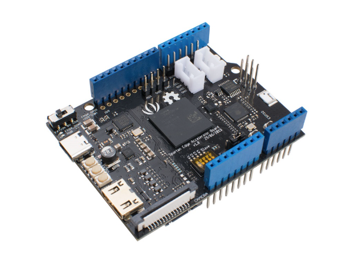

# ESP32-P4 DRO (Digital Readout) for Milling Machine & Lathe

This project provides a complete Digital Readout (DRO) system for milling machines and lathes using the JC8012P4A1C 10.1-inch ESP32-P4 board. It features a modern, high-performance HMI built with LVGL 9.2, designed with a **"Smart Client, Dumb Backend"** philosophy.

## 🏗️ System Architecture

- **Communication**: UART (115200 baud) for FPGA control; ESP-NOW/WiFi for wireless encoder connectivity.

## 🏗️ Flexible Architecture

This project supports two distinct hardware backends sharing the same Frontend and Protocol:

1. **FPGA Backend (Current ELS Focus)**:
    - **Hardware**: Spartan Edge Accelerator Board.
    - **Connection**: All Encoders (Spindle + 5 Axes) and Steppers connect **directly to the FPGA headers**.
    - **Data Flow**: P4 Frontend <-> FPGA (UART). Onboard ESP32 is unused (except for firmware updates).
    - **Use Case**: High-performance Electronic Leadscrew + DRO.

2. **ESP32 Backend (Future/Alternative)**:
    - **Hardware**: Standard ESP32/ESP32-S3.
    - **Connection**: Encoders connect to ESP32 PCNT (Pulse Counter) pins.
    - **Data Flow**: P4 Frontend <-> ESP32 Backend (UART).
    - **Use Case**: Cost-effective DRO-only system (no ELS).

*Note: The Frontend implementation is identical for both, as they share the same communication protocol.*

- **FPGA board**: Spartan Edge Accelerator Board

[Seeed Wiki](https://wiki.seeedstudio.com/Spartan-Edge-Accelerator-Board/)  

  

## 🚀 Key Features

- ✅ **HMI-Centric Design**: All math (ABS/INC, PCD, Tapers) happens on the display unit.
- ✅ **Multi-Axis Support**: X, Y, Z, W, C axis support with customizable mapping.
- ✅ **Electronic Leadscrew (ELS)**: Integration with Spartan-7 FPGA for threading and turning operations.
- ✅ **Modern UI**: Professional dark-mode interface designed for touch input (ISA-101 inspired).
- ✅ **Self-Contained**: All drivers (Display, Touch, Audio) included locally.

## 🔧 Hardware Configuration

- **Main Board**: ESP32-P4 (JC8012P4A1C 10.1-inch board)


- **Display**: 1280x800 MIPI-DSI LCD (JD9365 controller)
- **Touch**: GSL3680 capacitive touch controller
- **FPGA**: Xilinx Spartan-7 (Spartan Edge Accelerator Board)
- **Orientation**: Landscape mode (270-degree rotation)

### 🔌 Hardware Connections (UART)

The system relies on a **Cross-Wired** UART connection between the Frontend and Backend.

| Device | Type | Port | TX Pin | RX Pin | Note |
| :--- | :--- | :--- | :--- | :--- | :--- |
| **Frontend** | ESP32-P4 | UART1 | **GPIO 50** | **GPIO 51** | Fixed in `dro_pins.h` |
| **Backend** | ESP32 (DevKitC) | UART1 | **GPIO 17** | **GPIO 16** | Legacy Standard |
| **Backend** | ESP32-S3 | UART1 | **GPIO 1** | **GPIO 2** | Modern Standard |

**Wiring Guide**:

- Frontend **TX (50)** -> Backend **RX**
- Frontend **RX (51)** -> Backend **TX**
- **GND** -> **GND**

## 📦 Project Structure

```
DRO-10.1-inch/
├── components/                        # Local components
│   ├── dro_system/                   # Core DRO business logic
│   ├── eez/                          # LVGL UI implementation (EEZ Studio generated assets)
│   ├── fpga_comms/                   # FPGA communication driver
│   ├── machine_params/               # NVS storage for machine settings
│   ├── screw_calc/                   # Threading ratio calculator
│   └── cone_calc/                    # Taper turning calculator
├── common/                           # Shared protocol definitions
│   └── protocol_defs.h               # FPGA communication protocol
├── main/                             # Application entry point
└── README.md                         # This file
```

## 🛠️ Electronic Lead Screw (ELS)

The ELS subsystem uses the **Spartan Edge Accelerator Board**, which contains both a Xilinx Spartan-7 FPGA and an onboard ESP32.

> [!NOTE]
> **Modular Design**: The ELS functionality is optional. The system supports a setting to enable/disable ELS features, allowing the hardware to be used as a standalone DRO without the FPGA board.

**Architectural Note**: The data flow implementation for the Spartan board is currently flexible:

1. **Direct Bypass**: Frontend talks directly to the FPGA (via headers).
2. **Bridged**: Frontend talks to the onboard ESP32, which forwards data to the FPGA.

This ambiguity allows for future optimization (e.g., using the onboard ESP32 for additional wireless connectivity or co-processing).

- **Protocol**: Custom UART protocol (115200 baud). See `common/protocol_defs.h`.
- **Modes**:

  - **Screw Mode**: Automated gear ratio calculation for threading.
  - **Follow Mode**: Synchronized axis movement.
  - **Conical Mode**: Coordinated X/Z movement for tapers.

## 💻 Development

### Building and Flashing

```bash
# Build the project
idf.py build

# Flash to ESP32-P4
idf.py -p /dev/ttyUSB0 flash monitor
```

### Protocol Updates

The communication protocol is defined in `common/protocol_defs.h`. Any changes to command opcodes or structures should be made there and propagated to the FPGA firmware.

## 📄 License

This project follows the same license terms as the original ESP-IDF examples.

Absolutely — now that we know **you will NOT use the SD‑card, camera, or LCD**, we can categorize pins into two groups:

✅ **SAFE‑TO‑USE GPIOs** (only routed to the 2×17 connectors)  
⚠️ **GPIOs YOU MUST AVOID** (because they are connected to other onboard peripherals and could conflict)

The classification below is based entirely on the uploaded schematic contents **ESP32P4模组基础底板 V1.3**. [\[ESP32P4模组基础底板V1.3 \| PDF\]](https://molgroup-my.sharepoint.com/personal/felix_ovezea_molgroup_com/Documents/Microsoft%20Copilot%20%E3%83%81%E3%83%A3%E3%83%83%E3%83%88%20%E3%83%95%E3%82%A1%E3%82%A4%E3%83%AB/ESP32P4%E6%A8%A1%E7%BB%84%E5%9F%BA%E7%A1%80%E5%BA%95%E6%9D%BFV1.3.pdf)

***

# ✅ **Summary**

- Around **24 pins are totally free** and safe to use.
- The remaining **GPIOs are connected to:**
  - SD Card interface
  - Audio codec + I²S
  - Backlight, LCD\_RST/TE
  - CSI Camera reset
  - USB circuitry (download switch)
  - I²C shared bus
- These **should NOT be reused** unless you cut resistors or disable peripherals.

***

# ✅ **SAFE‑TO‑USE GPIOs**

These pins have *no internal connections* in the schematic other than the 2×17 headers.

    GPIO00
    GPIO01
    GPIO02
    GPIO03
    GPIO04
    GPIO05
    GPIO06
    GPIO14
    GPIO15
    GPIO16
    GPIO17
    GPIO18
    GPIO19
    GPIO22
    GPIO23
    GPIO24
    GPIO25
    GPIO27
    GPIO28
    GPIO29
    GPIO30
    GPIO31
    GPIO34
    GPIO35
    GPIO45
    GPIO46
    GPIO47
    GPIO48
    GPIO49
    GPIO50
    GPIO51
    GPIO52
    GPIO53  (used as audio amp input, but easily ignored if you don't populate amplifier)
    GPIO54

✅ All of the above are routed **only to connectors** or unused nets in the schematic.  
✅ These are ideal for your own peripherals.

***

# ⚠️ **GPIOs YOU SHOULD AVOID (Used by board peripherals)**

Below are all ESP32‑P4 pins that are **actively wired to something on the board** (from the schematic).

***

## **⚠️ I²C Bus (shared by codec, touch panel, camera)**

These two *must not be reused*:

    GPIO7 (I2C_SDA)
    GPIO8 (I2C_SCL)

They feed several devices via level shifter TXS0102.

***

## **⚠️ I²S Audio Codec (ES8311)**

These are hardwired:

    GPIO9
    GPIO10
    GPIO11
    GPIO12
    GPIO13

If ES8311 is unused, you could reclaim them, but you'd need to ensure the codec is held in reset.

***

## **⚠️ SD Card (TF Card)**

The TF‑card connector directly uses:

    GPIO39  (SD_D1)
    GPIO40  (SD_D2)
    GPIO41  (SD_D3)
    GPIO42  (SD_CMD)
    GPIO43  (SD_CLK)
    GPIO44  (SD_DET)

Since you said you **won't use SD**, you *can* reuse these **but be aware** that they are routed through 0Ω resistors.

✅ If needed, I can list which resistors to remove to free each pin.

***

## **⚠️ LCD Display (MIPI + control)**

Although MIPI is not GPIO, *control pins* are real GPIO:

    GPIO20  (LCD_BL – backlight)
    GPIO32  (LCD_RST)
    GPIO33  (LCD_TE)

If your board has no screen connected, these are harmless but still routed.

***

## **⚠️ CSI Camera**

CSI reset line:

    GPIO26 (CSI_RST)

Camera not used → this **can** be reused safely (only connected through a MOSFET Q1).

***

## **⚠️ USB Switching / Download Mode**

Used by C6/P4 download switches:

    GPIO37
    GPIO38

Better to avoid; they are tied into USB/UART mux logic.

***

# ✅ **FINAL CLEAN CATEGORIZED LIST**

***

## ✅ **Completely Safe GPIOs (recommended for custom use)**

(no functional connections except header)

    GPIO00
    GPIO01
    GPIO02
    GPIO03
    GPIO04
    GPIO05
    GPIO06
    GPIO14
    GPIO15
    GPIO16
    GPIO17
    GPIO18
    GPIO19
    GPIO22
    GPIO23
    GPIO24
    GPIO25
    GPIO27
    GPIO28
    GPIO29
    GPIO30
    GPIO31
    GPIO34
    GPIO35
    GPIO45
    GPIO46
    GPIO47
    GPIO48
    GPIO49
    GPIO50
    GPIO51
    GPIO52
    GPIO53*
    GPIO54

\*GPIO53 is connected *to the amplifier input*, but if amplifier is unused, it’s effectively free.

***

## ⚠️ **Pins you must avoid or use with caution**

(connected to onboard peripherals)

    GPIO7   (I2C)
    GPIO8   (I2C)

    GPIO9   (I2S Audio)
    GPIO10  (I2S Audio)
    GPIO11  (I2S Audio)
    GPIO12  (I2S Audio)
    GPIO13  (I2S Audio)

    GPIO20  (LCD Backlight)
    GPIO32  (LCD Reset)
    GPIO33  (LCD TE)

    GPIO26  (Camera Reset — safe if camera unused)

    GPIO37  (USB Mux)
    GPIO38  (USB Mux)

    GPIO39  (SD)
    GPIO40  (SD)
    GPIO41  (SD)
    GPIO42  (SD)
    GPIO43  (SD)
    GPIO44  (SD)
  