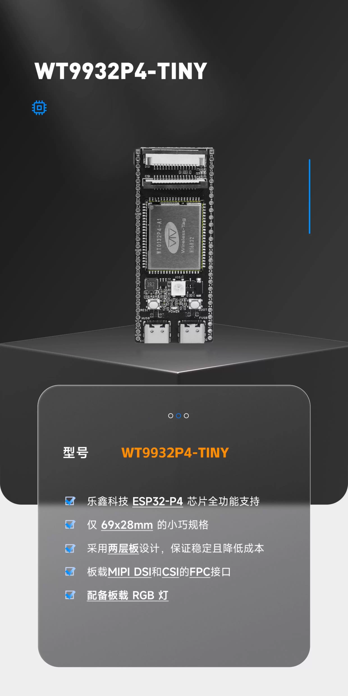

# ESP32-P4 DRO (Digital Readout) & Electronic Leadscrew (work in progress) 

This project provides a complete Digital Readout (DRO) and Electronic Leadscrew (ELS) system for milling machines and lathes using the JC8012P4A1C 10.1-inch ESP32-P4 display board. It features a modern, high-performance HMI built with LVGL 9.2, designed with a **"Smart Client, Dumb Backend"** philosophy. The board works in horisontal mode without tearing 

## 🏗️ System Architecture (not fully implemented yet)

- **Frontend (HMI)**: The 10.1-inch P4 Display calculates all math (ABS/INC, PCD, Tapers, Threading Ratios) locally.
- **Backend (Hardware Controller)**: A separate ESP32 handles rapid pulse-counting (PCNT) from glass scales/encoders and outputs motor control signals (RMT/MCPWM) to stepper drivers.
- **Communication**: The system uses a reliable **USB HID** protocol instead of legacy UART to transmit configuration, axis telemetry, and synchronization data between the display and the motion controller.
- **Not all the calculation are finished**: The UI is up but not all buttons have functionality. The communication between frontend and backend works on High Speed USB but shoul be used a dumb cable. Not all cable
- work 
---

## 🖥️ The Frontend (HMI)

- **Main Board**: ESP32-P4 (JC8012P4A1C 10.1-inch board)
- **Display**: 1280x800 MIPI-DSI LCD (JD9365 controller) in Landscape mode.
- **Touch**: GSL3680 capacitive touch controller.
- **UI Framework**: Strictly C-based LVGL (EEZ Studio generation is now deprecated, modifying `screens.c` directly).


## 🎛️ The Backend (Hardware Controllers)

This project has completely migrated away from FPGA-based controllers. The Electronic Leadscrew and encoder tracking are now entirely driven by powerful ESP32-series dual-core and quad-core microcontrollers.

Because we use a unified **ESP-IDF Kconfig Architecture**, the same `esp32p4_usb_dro_backend` codebase targets multiple backend boards seamlessly by isolating pinouts into a multiplexed Board Support Package (`bsp.h`).

### Supported Backend Hardware

#### 1. ESP32-P4C6-osprey Baseboard

The primary high-performance development board.


#### 2. ESP32-P4 WT9932P4-TINY

A compact ESP32-P4 variant with carefully re-routed USB tracking and bootstrap pins to preserve USB-HID capability without stepper collision.


#### 3. ESP32-S3 Generic Board

A cost-effective fallback for legacy ESP32-S3 dual-core architectures.

---

## 🚀 Key Features

- ✅ **HMI-Centric Design**: All math (ABS/INC, PCD, Tapers) happens on the display unit.
- ✅ **Multi-Axis Support**: 5 virtual axes (X, Y, Z, W, C) + dedicated Spindle tracking with customizable mapping.
- ✅ **Button-Tap Centric UI**: The UI has been rigidly locked to prevent accidental horizontal swiping/sliding on settings tabs, optimized for industrial machine screens with dirty/gloved hands.
- ✅ **Electronic Leadscrew (ELS)**: Stepper synchronization for threading, follow mode, and conical turning operations directly through the ESP32 backend.
- ✅ **USB HID Bridge**: No fragile RS485/UART wiring required. The display and backend talk natively over a customized standard USB connection.

---

## 📦 Project Structure

```text
DRO-10.1-inch/
├── components/                        # Local frontend components
│   ├── dro_system/                   # Core DRO business logic & Axis mapping
│   ├── eez/                          # LVGL UI implementation (Manual C edits)
│   ├── frontend_usb/                 # USB Host HID driver bridging
│   ├── machine_params/               # NVS storage for machine settings
│   ├── screw_calc/                   # Threading ratio calculator
│   └── cone_calc/                    # Taper turning calculator
├── esp32p4_usb_dro_backend/          # THE UNIFIED BACKEND REPOSITORY
│   ├── main/                         # USB Device HID stack & ELS algorithm
│   └── modules/BSP/                  # Multi-Board Support Package (Pinouts)
└── README.md                         # This file
```

## 💻 Development

### Compiling the Backend

The Backend uses ESP-IDF's Target and Kconfig systems to select the physical board logic at compile-time.

```bash
# 1. Set your silicon target (e.g. esp32p4 or esp32s3)
idf.py set-target esp32p4

# 2. Open the Configuration Menu to select the EXACT board
idf.py menuconfig
# -> Navigate to "E-Leadscrew Hardware Selection"
# -> Choose "ESP32-P4 WT9932P4-TINY" or "ESP32-P4C6-osprey Baseboard"

# 3. Build & Flash
idf.py build flash monitor
```

> [!WARNING]
> Ensure you plug the USB cable into your **FS (Full-Speed / JTAG)** port when flashing the backend board, but plug the display (or PC for testing) into the **HS (High-Speed / OTG)** port for the USB HID protocol to communicate!

## 🛣️ Implementation Roadmap

### ✅ What is Working Right Now

- **The Modern LVGL 9.2 Frontend**: Fast, dark-mode styling, and entirely button-driven navigation optimized to prevent accidental gestures in an industrial shop environment.
- **Smart Math Core**: Fully decoupled local math inside the display processor handling all PCD, Taper, and ABS/INC calculations.
- **USB HID Bridge**: A stable, high-speed custom USB HID datalink connecting the Frontend Display directly to the Backend microcontrollers, fully deprecating the legacy FPGA/RS485 setups.
- **Multi-Board SDK Architecture**: The backend successfully targets custom ESP32-P4 footprints (Osprey, TINY) and legacy S3 boards via a clean Kconfig matrix that automatically patches pinouts at compile-time to prevent hardware conflicts.
- **Dual Firmware Roles (Kconfig)**: The same codebase flashes as either a full DRO/ELS Backend or a lightweight Spindle Pulse Generator for Hardware-in-the-Loop (HIL) testing — no second repository needed.
- **Pulse Counting (PCNT)**: Hardware quadrature decoding using the ESP32's native PCNT peripherals to track physical glass scales.
- **PCNT Infinite-Range Overflow Compensation**: Hardware watchpoint callbacks (`CONFIG_PCNT_ISR_IRAM_SAFE`) maintain a 64-bit software accumulator per axis, giving truly infinite travel range without delta-unwrapping hacks.
- **50kHz GPTimer DDA Stepper Engine**: A bare-metal hardware timer ISR fires 50,000 times per second to run the Bresenham Digital Differential Analyzer, generating perfectly timed 20µs STEP pulses synchronized to the spindle encoder — all without blocking FreeRTOS.

### 🚧 What is Not Yet Tested / Hardware Pending

- **HIL Loopback Validation**: Hardware wiring not yet connected. The `[HIL]` console printouts are in place — pending jumper wires from STEP_X output back into ENC_X_A input.
- **Open-Loop ELS Mode**: Algorithm is implemented in the GPTimer ISR. Needs physical spindle encoder wired to Spindle PCNT pins to validate.
- **Closed-Loop Feedback Algorithm**: Architecture is ready. Error-correction logic between `target_steps_generated` and the loopback PCNT axis count to be implemented after HIL validation confirms open-loop is correct.
- **Hardware Machine Interlocks**: Complete bridging of physical Limit Switches and E-Stop pins into the LVGL warning dialogs.

## 📋 Development Log

### 2026-04-02 — ELS Motor Engine & HIL Architecture

#### Board Support & Build System

- Renamed `BOARD_ESP32P4_EVO` → `CONFIG_BOARD_ESP32P4C6_OSPREY` across `Kconfig.projbuild` and `bsp.h` to match the physical board branding.
- Added a second Kconfig dimension: **`ROLE_TARGET`** — the same binary can now be flashed as either the full `DRO/ELS Backend` or a lightweight `HIL Test Generator` (no second repository needed).
- Created `generator_main.c`: a FreeRTOS task that outputs realistic A/B quadrature pulses on the Spindle PCNT pins to simulate a spinning lathe chuck during bench testing.

#### PCNT Overflow & Infinite-Range Positioning

- Discovered the ESP32-P4 has only **4 PCNT hardware units** (down from 8 on classic ESP32). Resolved by reserving 3 units for axes (X, Y, Z) and 1 for the Spindle.
- Replaced naive 16-bit counter reads with a proper **hardware watchpoint + IRAM-safe ISR** overflow system:
  - `pcnt_unit_add_watch_point()` registers triggers at `±32000`.
  - A shared `IRAM_ATTR pcnt_overflow_cb()` atomically adjusts a per-unit `int64_t` software accumulator on every hardware overflow.
  - True absolute position is always `hw_count + overflow_accum` — effectively infinite travel range.
  - `CONFIG_PCNT_ISR_IRAM_SAFE=y` added to `sdkconfig.defaults` so callbacks fire reliably even during TinyUSB flash cache flushes.

#### 50kHz GPTimer DDA Stepper Engine

- Replaced the old simulated FreeRTOS while-loop step generator with a **real-time bare-metal `gptimer` ISR** running at **50,000 Hz** (20 µs period).
- Each ISR tick runs the **Bresenham Digital Differential Analyzer (DDA)**:
  1. Reads the absolute spindle position.
  2. Computes the movement delta since the last tick.
  3. Adds `delta × ratio` to a Q16.16 fixed-point phase accumulator.
  4. When the accumulator overflows `1.0`, fires one 20 µs STEP pulse and updates the DIR pin.
- This approach delivers mathematically perfect spindle synchronization with zero buffering latency (no RMT buffers, no MCPWM restarts).
- The FreeRTOS `backend_els_task` is now a slow 100 Hz background loop handling only acceleration ramping, USB telemetry, and HIL printouts.

#### HIL Validation Printouts

- Added `[HIL]` 1 Hz console log comparing `target_steps_generated` vs absolute loopback PCNT count to validate the full open-loop round trip once hardware is wired.

**Status at end of session:** Compiles and runs stable on ESP32-P4. Hardware wiring pending.

---

## 📄 License

This project follows the same license terms as the original ESP-IDF examples.
